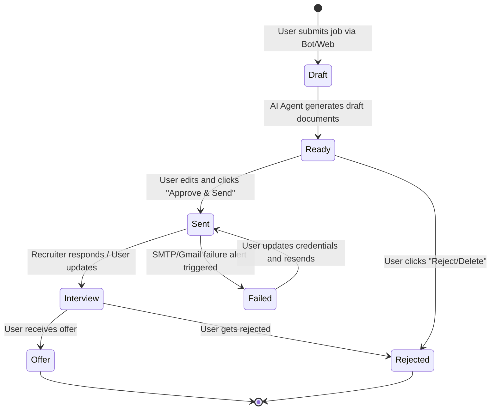

# Data Model: Jobexa Platform

## Entity Schema

### 1. User
Represents a registered user on the Web Dashboard who can pair with a Telegram account.

| Field Name | Type | Constraints | Description |
| :--- | :--- | :--- | :--- |
| `id` | UUID | Primary Key | Unique user identifier. |
| `email` | String | Unique, Indexed, Not Null | Dashboard login email. |
| `hashed_password` | String | Not Null | Hashed login credentials. |
| `telegram_chat_id` | String | Unique, Nullable | Linked Telegram account identifier. |
| `telegram_pairing_token` | String | Nullable, Indexed | 6-digit alphanumeric temporary token. |
| `pairing_token_expires_at`| DateTime | Nullable | Expiration time for pairing token (10 min).|
| `created_at` | DateTime | Not Null, Default Now | Creation timestamp. |
| `updated_at` | DateTime | Not Null, Default Now | Modification timestamp. |

### 2. Resume
Represents a resume PDF uploaded by the user.

| Field Name | Type | Constraints | Description |
| :--- | :--- | :--- | :--- |
| `id` | UUID | Primary Key | Unique identifier. |
| `user_id` | UUID | Foreign Key (User) | Owner of the resume. |
| `filename` | String | Not Null | Name of the file. |
| `file_url` | String | Not Null | Supabase Storage URL. |
| `file_size` | Integer | Not Null, <= 5MB | Size of the document. |
| `role_tag` | String | Nullable | Label indicating the targeted role (e.g. backend). |
| `is_default` | Boolean | Not Null, Default False | If this is the primary resume for matching. |
| `created_at` | DateTime | Not Null, Default Now | Upload timestamp. |

### 3. Certificate
Represents a professional certificate PDF uploaded by the user.

| Field Name | Type | Constraints | Description |
| :--- | :--- | :--- | :--- |
| `id` | UUID | Primary Key | Unique identifier. |
| `user_id` | UUID | Foreign Key (User) | Owner of the certificate. |
| `filename` | String | Not Null | Name of the file. |
| `file_url` | String | Not Null | Supabase Storage URL. |
| `file_size` | Integer | Not Null, <= 5MB | Size of the document. |
| `category` | String | Nullable | Category (AI, Cloud, Internship). |
| `created_at` | DateTime | Not Null, Default Now | Upload timestamp. |

### 4. JobOpportunity
Represents a job post parsed by the AI agents.

| Field Name | Type | Constraints | Description |
| :--- | :--- | :--- | :--- |
| `id` | UUID | Primary Key | Unique identifier. |
| `company_name` | String | Nullable | Extracted company name. |
| `job_title` | String | Nullable | Extracted role title. |
| `required_skills` | JSONB | Not Null, Default `[]` | List of mandatory skills. |
| `preferred_skills` | JSONB | Not Null, Default `[]` | List of optional/preferred skills. |
| `recruiter_email` | String | Nullable | Email address to apply to. |
| `application_deadline` | Date | Nullable | Extracted application deadline. |
| `raw_content` | Text | Not Null | Original text, URL, or image OCR text. |
| `original_source_url` | String | Nullable | Source job board URL (if available). |
| `created_at` | DateTime | Not Null, Default Now | Extraction timestamp. |

### 5. ApplicationDraft
Represents the generated AI drafts awaiting review.

| Field Name | Type | Constraints | Description |
| :--- | :--- | :--- | :--- |
| `id` | UUID | Primary Key | Unique identifier. |
| `user_id` | UUID | Foreign Key (User) | Target applicant. |
| `job_opportunity_id` | UUID | Foreign Key (Job) | Target job opportunity. |
| `email_subject` | String | Nullable | Tailored subject line. |
| `email_body` | Text | Nullable | Tailored application cover letter/body. |
| `cover_letter` | Text | Nullable | Additional standalone cover letter document. |
| `recommended_resume_id` | UUID | Foreign Key (Resume) | AI-selected resume for this post. |
| `recommended_certificate_ids`| JSONB| Not Null, Default `[]` | List of certificate UUIDs to attach. |
| `ats_compatibility_score` | Integer | Not Null, 0-100 | Calculated ATS match score. |
| `skill_match_score` | Integer | Not Null, 0-100 | Skill overlap score. |
| `experience_match_score` | Integer | Not Null, 0-100 | Experience validation score. |
| `status` | String | Not Null, Default 'Draft'| Draft state (Draft, Ready). |
| `created_at` | DateTime | Not Null, Default Now | Creation timestamp. |
| `updated_at` | DateTime | Not Null, Default Now | Modification timestamp. |

### 6. ApplicationRecord
Represents the permanent historical archive of a submitted application.

| Field Name | Type | Constraints | Description |
| :--- | :--- | :--- | :--- |
| `id` | UUID | Primary Key | Unique identifier. |
| `user_id` | UUID | Foreign Key (User) | Applicant. |
| `company_name` | String | Not Null | Applied company. |
| `position` | String | Not Null | Applied position name. |
| `date_applied` | DateTime | Not Null, Default Now | Sent timestamp. |
| `email_sent_body` | Text | Not Null | Final approved email body sent. |
| `email_subject` | String | Not Null | Final approved subject line. |
| `sent_resume_url` | String | Not Null | Permanent URL of the attached resume. |
| `sent_certificate_urls` | JSONB | Not Null, Default `[]` | URLs of attached certificates. |
| `status` | String | Not Null | Status (Sent, Interview, Offer, Rejected, Failed). |
| `created_at` | DateTime | Not Null, Default Now | Creation timestamp. |
| `updated_at` | DateTime | Not Null, Default Now | Modification timestamp. |

## Lifecycle States

