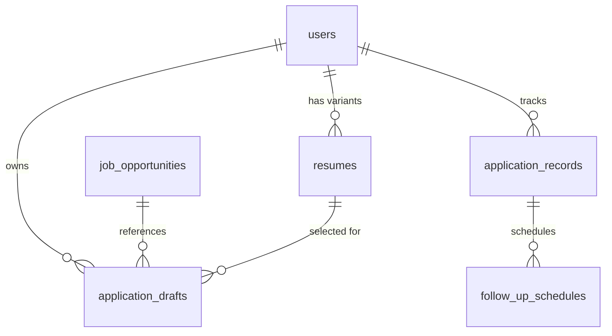

# Database Schema & Data Models

## Modified Tables

### `users` (Table updates)
- `gmail_access_token` (String, nullable) - Encrypted user access token
- `gmail_refresh_token` (String, nullable) - Encrypted refresh token for automated token refresh
- `gmail_token_expires_at` (DateTime, nullable) - Expiration timestamp of the access token

### `resumes` (Table updates)
- `markdown_content` (Text, nullable) - Raw markdown source content used for dynamic PDF compiling

### `job_opportunities` (Table updates)
- `experience_level` (String, nullable) - e.g., "Mid-Senior", "Entry"
- `salary_range` (String, nullable) - e.g., "$120,000 - $140,000"

### `application_drafts` (Table updates)
- `selected_resume_id` (UUID, nullable) - Foreign key referencing the chosen `resumes` variant

### `application_records` (Table updates)
- `thread_id` (String, nullable) - Google Gmail API Thread ID for reply tracking

---

## New Tables

### `follow_up_schedules`
Stores automated follow-up emails generated for each application record.

| Column | Type | Constraints | Description |
| :--- | :--- | :--- | :--- |
| `id` | UUID | Primary Key | |
| `application_record_id` | UUID | Foreign Key, CASCADE | Links to the parent application |
| `scheduled_days_after` | Integer | NOT NULL | Default: 5, 10, or 15 days |
| `status` | String | NOT NULL | `Pending`, `Approved`, `Sent`, `Cancelled` |
| `email_subject` | String | NOT NULL | Generated follow-up subject line |
| `email_body` | Text | NOT NULL | Generated follow-up body content |
| `scheduled_send_at` | DateTime | NOT NULL | Calculated trigger timestamp |
| `sent_at` | DateTime | Nullable | Exact timestamp email was dispatched |
| `created_at` | DateTime | NOT NULL | |

- **Foreign Key**: `application_record_id` -> `application_records(id)` ON DELETE CASCADE

### `company_profiles`
Caches LLM-generated and scraped research on target companies.

| Column | Type | Constraints | Description |
| :--- | :--- | :--- | :--- |
| `id` | UUID | Primary Key | |
| `company_name` | String | Unique, Indexed | Standardized company name |
| `tech_stack` | JSONB | Nullable | List of technologies identified |
| `recent_products` | JSONB | Nullable | List of recent products/news |
| `news_items` | JSONB | Nullable | Raw articles or announcements |
| `last_refreshed_at` | DateTime | NOT NULL | Timestamp to check cache age |

---

## Entity Relationship Diagram (Mental Model)

